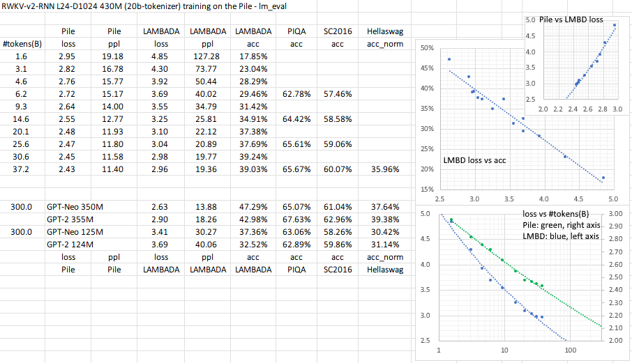

# The RWKV Language Model (and my tricks for LMs)

## RWKV-2: RNN with Transformer-level Performance

RWKV-2 is a RNN with Transformer-level performance, which can also be directly trained like a GPT transformer (parallelizable). And it's attention-free. You only need x_t, a_t, b_t of position t to compute the vectors for position t+1. You can use the "GPT" mode to quickly build the hidden state for the "RNN" mode.

So it's combining the best of RNN and transformer - great performance, fast inference, saves VRAM, fast training, "infinite" ctx_len, and free sentence embedding.

Reddit discussion: https://www.reddit.com/r/MachineLearning/comments/umq908/r_rwkvv2rnn_a_parallelizable_rnn_with/

Tweet from Sepp Hochreiter (thank you!): https://twitter.com/HochreiterSepp/status/1524270961314484227

**You can find me (BlinkDL) in the EleutherAI Discord: https://www.eleuther.ai/get-involved/.**

User feedback:
> *I've so far toyed around the character-based model on our relatively small pre-training dataset (around 10GB of text), and the results are extremely good - similar ppl to models taking much, much longer to train.*

I am training it on the Pile (https://github.com/BlinkDL/RWKV-v2-RNN-Pile) and it shall be able to reach GPT-Neo performance on most tasks within 100B tokens:



All of the trained models will be open-source. Inference is very fast (only matrix-vector multiplications, no matrix-matrix multiplications) even on CPUs, and I believe you can run a 1B params RWKV-v2-RNN with reasonable speed on your phone.

## Quick start

Check https://github.com/BlinkDL/RWKV-v2-RNN-Pile for L24-D1024 and L12-D768 models trained on the Pile (and the latest code). It's very fast on CPU (the default mode).

Read the inference code in https://github.com/BlinkDL/RWKV-v2-RNN-Pile/blob/main/src/model.py and try using the final hidden state（.xx .aa .bb) as a faithful sentence embedding for other tasks.

See the release here for a 27M params model on enwik8 with 0.72 BPC(dev). Run run.py in https://github.com/BlinkDL/RWKV-LM/tree/main/RWKV-v2-RNN.

You can even run it in your browser: https://github.com/BlinkDL/AI-Writer/tree/main/docs/eng https://blinkdl.github.io/AI-Writer/eng/ (this is using tf.js WASM single-thread mode).

Fine-tuning & training (I usually fine-tune with 4e-5 lr, and decay to 1e-5 when it plateaus):
https://github.com/BlinkDL/RWKV-LM/tree/main/RWKV-v2-RNN

**Important**: For fine-tuning the Pile model, change 1e-15 to 1e-9 (to avoid NaN) in https://github.com/BlinkDL/RWKV-LM/blob/main/RWKV-v2-RNN/src/model.py and https://github.com/BlinkDL/RWKV-LM/blob/main/RWKV-v2-RNN/src/model_run.py and probably you need other changes as well. You can compare the output with the latest code ( https://github.com/BlinkDL/RWKV-v2-RNN-Pile ) to verify it.

## How it works

RWKV is inspired by Apple's AFT (https://arxiv.org/abs/2105.14103).

### From GPT to RWKV-2 (the formulas)

Let F[t] be the system state at t.

Let x[t] be the new external input at t.

In GPT, predicting F[t+1] requires considering F[0], F[1], .. F[t]. So it takes O(T^2) to generate a length T sequence.

The **simplified formula** for GPT:

![F[\mathrm{t}+1]=\frac{\sum_{\mathrm{i}=0}^{\mathrm{t}} \exp (\mathbf{Q}x[\mathrm{t}] * \mathbf{K}F[\mathrm{i}]) \cdot(\mathbf{V}F[\mathrm{i}])}{\sum_{\mathrm{i}=0}^{\mathrm{t}} \exp (\mathbf{Q}x[\mathrm{t}] * \mathbf{K}F[\mathrm{i}])}](https://render.githubusercontent.com/render/math?math=%5Ccolor%7Bblack%7D%5Cdisplaystyle+F%5B%5Cmathrm%7Bt%7D%2B1%5D%3D%5Cfrac%7B%5Csum_%7B%5Cmathrm%7Bi%7D%3D0%7D%5E%7B%5Cmathrm%7Bt%7D%7D+%5Cexp+%28%5Cmathbf%7BQ%7Dx%5B%5Cmathrm%7Bt%7D%5D+%2A+%5Cmathbf%7BK%7DF%5B%5Cmathrm%7Bi%7D%5D%29+%5Ccdot%28%5Cmathbf%7BV%7DF%5B%5Cmathrm%7Bi%7D%5D%29%7D%7B%5Csum_%7B%5Cmathrm%7Bi%7D%3D0%7D%5E%7B%5Cmathrm%7Bt%7D%7D+%5Cexp+%28%5Cmathbf%7BQ%7Dx%5B%5Cmathrm%7Bt%7D%5D+%2A+%5Cmathbf%7BK%7DF%5B%5Cmathrm%7Bi%7D%5D%29%7D)

Compare with the **simplified formula** for RWKV-2 (the parallel mode, looks similar to Apple's AFT):

![F[\mathrm{t}+1]=\sigma(\mathbf{R}x[\mathrm{t}]) \cdot \frac{\sum_{\mathrm{i}=0}^{\mathrm{t}} \exp (\mathbf{W} \cdot(\mathrm{t}-\mathrm{i})) \cdot \exp (\mathbf{K}F[\mathrm{i}]) \cdot(\mathbf{V}F[\mathrm{i}])}{\sum_{\mathrm{i}=0}^{\mathrm{t}} \exp (\mathbf{W} \cdot(\mathrm{t}-\mathrm{i})) \cdot \exp (\mathbf{K }F[\mathrm{i}])}](https://render.githubusercontent.com/render/math?math=%5Ccolor%7Bblack%7D%5Cdisplaystyle+F%5B%5Cmathrm%7Bt%7D%2B1%5D%3D%5Csigma%28%5Cmathbf%7BR%7Dx%5B%5Cmathrm%7Bt%7D%5D%29+%5Ccdot+%5Cfrac%7B%5Csum_%7B%5Cmathrm%7Bi%7D%3D0%7D%5E%7B%5Cmathrm%7Bt%7D%7D+%5Cexp+%28%5Cmathbf%7BW%7D+%5Ccdot%28%5Cmathrm%7Bt%7D-%5Cmathrm%7Bi%7D%29%29+%5Ccdot+%5Cexp+%28%5Cmathbf%7BK%7DF%5B%5Cmathrm%7Bi%7D%5D%29+%5Ccdot%28%5Cmathbf%7BV%7DF%5B%5Cmathrm%7Bi%7D%5D%29%7D%7B%5Csum_%7B%5Cmathrm%7Bi%7D%3D0%7D%5E%7B%5Cmathrm%7Bt%7D%7D+%5Cexp+%28%5Cmathbf%7BW%7D+%5Ccdot%28%5Cmathrm%7Bt%7D-%5Cmathrm%7Bi%7D%29%29+%5Ccdot+%5Cexp+%28%5Cmathbf%7BK+%7DF%5B%5Cmathrm%7Bi%7D%5D%29%7D)

The R, K, V are trainable matrices, and W is a trainable vector (time-decay factor for each channel).

In GPT, the contribution of F[i] to F[t+1] is weighted by ![ \exp (\mathbf{Q}x[\mathrm{t}] * \mathbf{K}F[\mathrm{i}]) ](https://render.githubusercontent.com/render/math?math=%5Ccolor%7Bblack%7D%5Cdisplaystyle++%5Cexp+%28%5Cmathbf%7BQ%7Dx%5B%5Cmathrm%7Bt%7D%5D+%2A+%5Cmathbf%7BK%7DF%5B%5Cmathrm%7Bi%7D%5D%29+).

In RWKV-2, the contribution of F[i] to F[t+1] is weighted by ![\sigma(\mathbf{R}x[\mathrm{t}]) \cdot \exp (\mathbf{W} \cdot(\mathrm{t}-\mathrm{i})) \cdot \exp (\mathbf{K}F[\mathrm{i}]) ](https://render.githubusercontent.com/render/math?math=%5Ccolor%7Bblack%7D%5Cdisplaystyle+%5Csigma%28%5Cmathbf%7BR%7Dx%5B%5Cmathrm%7Bt%7D%5D%29+%5Ccdot+%5Cexp+%28%5Cmathbf%7BW%7D+%5Ccdot%28%5Cmathrm%7Bt%7D-%5Cmathrm%7Bi%7D%29%29+%5Ccdot+%5Cexp+%28%5Cmathbf%7BK%7DF%5B%5Cmathrm%7Bi%7D%5D%29+).
* The  is a non-linearity and we can use sigmoid. 
* Note ![\sigma(\mathbf{R}x[\mathrm{t}])](https://render.githubusercontent.com/render/math?math=%5Ccolor%7Bblack%7D%5Cdisplaystyle+%5Csigma%28%5Cmathbf%7BR%7Dx%5B%5Cmathrm%7Bt%7D%5D%29) is not in the denominator, and I call R the "receptance".
* The  is the time-decay factor. I proposed the same idea (scaling the attention by distance) in Aug 2020 and called it the "time-weighting" (check the commit history of https://github.com/BlinkDL/minGPT-tuned).

Here comes the punchline: we can rewrite it into a RNN (recursive formula). Note:

![F[1]=\sigma(\mathbf{R }x[0]) \cdot \frac{ \exp (\mathbf{K }F[0]) \cdot(\mathbf{V }F[0])}{\exp (\mathbf{K }F[0])}](https://render.githubusercontent.com/render/math?math=%5Ccolor%7Bblack%7D%5Cdisplaystyle+F%5B1%5D%3D%5Csigma%28%5Cmathbf%7BR+%7Dx%5B0%5D%29+%5Ccdot+%5Cfrac%7B+%5Cexp+%28%5Cmathbf%7BK+%7DF%5B0%5D%29+%5Ccdot%28%5Cmathbf%7BV+%7DF%5B0%5D%29%7D%7B%5Cexp+%28%5Cmathbf%7BK+%7DF%5B0%5D%29%7D)

![F[2]=\sigma(\mathbf{R }x[1]) \cdot \frac{ \exp (\mathbf{K }F[1]) \cdot(\mathbf{V }F[1])+\exp (\mathbf{W} ) \cdot \exp (\mathbf{K }F[0]) \cdot(\mathbf{V }F[0])}{ \exp (\mathbf{K }F[1])+\exp (\mathbf{W} ) \cdot \exp (\mathbf{K }F[0])}](https://render.githubusercontent.com/render/math?math=%5Ccolor%7Bblack%7D%5Cdisplaystyle+F%5B2%5D%3D%5Csigma%28%5Cmathbf%7BR+%7Dx%5B1%5D%29+%5Ccdot+%5Cfrac%7B+%5Cexp+%28%5Cmathbf%7BK+%7DF%5B1%5D%29+%5Ccdot%28%5Cmathbf%7BV+%7DF%5B1%5D%29%2B%5Cexp+%28%5Cmathbf%7BW%7D+%29+%5Ccdot+%5Cexp+%28%5Cmathbf%7BK+%7DF%5B0%5D%29+%5Ccdot%28%5Cmathbf%7BV+%7DF%5B0%5D%29%7D%7B+%5Cexp+%28%5Cmathbf%7BK+%7DF%5B1%5D%29%2B%5Cexp+%28%5Cmathbf%7BW%7D+%29+%5Ccdot+%5Cexp+%28%5Cmathbf%7BK+%7DF%5B0%5D%29%7D)

Therefore it's straightforward to verify:

![F[t+1]=\sigma(\mathbf{R }x[t]) \cdot \frac{\exp (\mathbf{K}F[\mathrm{t}]) \cdot(\mathbf{V}F[\mathrm{t}])+\exp (\mathbf{W}) \cdot A[\mathrm{t}]}{ \exp (\mathbf{K}F[\mathrm{t}])+\exp (\mathbf{W}) \cdot B[\mathrm{t}]}](https://render.githubusercontent.com/render/math?math=%5Ccolor%7Bblack%7D%5Cdisplaystyle+F%5Bt%2B1%5D%3D%5Csigma%28%5Cmathbf%7BR+%7Dx%5Bt%5D%29+%5Ccdot+%5Cfrac%7B%5Cexp+%28%5Cmathbf%7BK%7DF%5B%5Cmathrm%7Bt%7D%5D%29+%5Ccdot%28%5Cmathbf%7BV%7DF%5B%5Cmathrm%7Bt%7D%5D%29%2B%5Cexp+%28%5Cmathbf%7BW%7D%29+%5Ccdot+A%5B%5Cmathrm%7Bt%7D%5D%7D%7B+%5Cexp+%28%5Cmathbf%7BK%7DF%5B%5Cmathrm%7Bt%7D%5D%29%2B%5Cexp+%28%5Cmathbf%7BW%7D%29+%5Ccdot+B%5B%5Cmathrm%7Bt%7D%5D%7D)

where A[t] and B[t] are the numerator and denominator of the previous step, respectively.

I believe RWKV-2 is performant because W is like repeatedly applying a diagonal matrix. Note (P^{-1} D P)^n = P^{-1} D^n P, so it is similar to repeatedly applying a general diagonalizable matrix.

Moreover it's possible to turn it into a continuous ODE (a bit similar to State Space Models). I will write about it later.

### The pseudocode (execution from top to bottom):


The a b c d factors work together to build a time-decay curve: X, 1, W, W^2, W^3, ...

Write out the formulas for "token at pos 2" and "token at pos 3" and you will get the idea:
* a and b: EMAs of kv and k.
* c and d: these are a and b combined with "self-attention".

kv / k is the memory mechanism. The token with high k can be remembered for a long duration, if W is close to 1 in the channel.

RWKV v2 is parallelizable because the time-decay of each channel is data-independent (and trainable). For example, in usual RNN you can adjust the time-decay of a channel from say 0.8 to 0.5 (these are called "gates"), while in RWKV v2 you simply move the information from a W-0.8-channel to a W-0.5-channel to achieve the same effect.

It's also using my SmallInitEmb trick https://github.com/BlinkDL/SmallInitEmb (applicable to all transformers), and a custom CUDA kernel https://github.com/BlinkDL/RWKV-CUDA .

I find it might be nice to make the model stay on a mid-lr for a long period, because in theory that's where most learning shall happen. For example: constant 6e-4 for 10% of steps, 6e-4 to 1e-4 in 15% of steps, stays at 1e-4 for 25% of steps (actually I monitor the loss and decay the lr when it plateaus), then 1e-4 to 1e-5 in 50% of steps.

## How to sample a large dataset (for training)

I am using a trick to sample the Pile deterministically yet randomly enough.

Let's say the pile has x chunks (a chunk = ctx_len tokens).

pick a prime number p just less than x, and make sure p = 2 (mod 3).

Use (step * step * step) mod p to sample it. Add some bias to step for extra randomness.

## The top-p-x sampling method (for inference)

We propose a new sampling method called top-p-x:

it's like top-p, and the only difference is you also keep all tokens whose prob > x.

Try x = 0.01 first.

## Better Learning Rate Schedule via Variantional Method of Loss Curve

I propose a simple new method to find better LR schedules. The method is cost-efficient and practical for large LMs. The takeaway is we can model the loss curve dynamics (phenomenology) w.r.t. the LR, and a nice closed-form LR curve can be directly computed from it using variantional method. Moreover we can predict the final loss with reasonable accuracy.

UPDATE: In "Conclusion 1.", use the best-fitting regime (ignore the initial steps where our approximations break down) to fit the parameters.

Try this: fixed lr for 1 hr, then exponential decay to 0.2 * lr in 12 hrs, and choose the t=[1hr, 13hr] segment.

In the last three plots, black = predicted loss curve of the new LR schedule, blue = original (unoptimized) real loss curve, orange = new LR schedule.


# RWKV v1

We propose the RWKV language model, with alternating time-mix and channel-mix layers:


* The R, K, V are generated by linear transforms of input, and W is parameter. The idea of RWKV is to decompose attention into R(target) * W(src, target) * K(src). So we can call R "receptance", and sigmoid means it's in 0~1 range.

* The Time-mix is similar to AFT (https://arxiv.org/abs/2105.14103). There are two differences.

(1) We changed the normalization (denominator). For masked language models, we define:


**(UPDATE: We are using the original AFT normalization in v2)**
 
Initialize K and R matrices (and the output projection matrix) to ZERO for fast & stable convergence.
 
(2) We decompose W_{t,u,c} and introduce multi-head W (here h is the corresponding head of c):


Moreover we multiply the final output of Time-mix layer by γ(t). The reason for the α β γ factors, is because the context size is smaller when t is small, and this can be compensated using the α β γ factors.

**(UPDATE: We remove α β γ factors in v2-RNN and restrict W to be of a simple form and hence able to rewrite it as RNN)**

* The Channel-mix is similar to GeGLU (https://arxiv.org/abs/2002.05202) with an extra R factor. Initialize R and W matrices to ZERO for fast & stable convergence.

* Finally, we add extra token-shift (time-shift mixing) as in (https://github.com/BlinkDL/minGPT-tuned).

# Token-shift (time-shift mixing)

The token-shift explicitly uses (half the channels of this token) & (half the channels of prev token) to generate all vectors (QKV, RWKV, ...).

```
self.time_shift = nn.ZeroPad2d((0,0,1,-1))

x = torch.cat([self.time_shift(x[:, :, :C//2]), x[:, :, C//2:]], dim = -1)
```

Dividing channels by 2 and shift-1 works great for char-level English and char-level Chinese LM.

However for BPE-level English LM, it's only effective if your embedding is large enough (at least 1024 - so the usual small L12-D768 model is not enough).

My theory on the effectiveness of token-shift:

When we train a GPT, the hidden representation of a token has to accomplish two different objects:

1. Predict the next token. Sometimes this is easy (obvious next token).

2. Collect all previous context info, so later tokens can use it. This is always hard.

The shifted channels can focus on (2), so we have good propagation of info. It's like some kind of residual connection, or a small RNN inside the transformer.

You can use token-shift in usual QKV self-attention too. I looked at the weights, and found V really likes the shifted channels, less so for Q. Makes sense if you think about it. I also found you may want to use less mixing in higher layers.

p.s. There is a MHA_pro model in this repo with strong performance. Give it a try :)

# The Head-QK Trick: learning to copy and avoid tokens

In usual transformer, a small model has difficulty copying tokens (such as person names) in the context. We add extra Q & K to the final output such that the model can directly copy (or avoid) tokens in the context. Afterwards the model will teach itself NER (named entity recognition) if you look at the learned weights.
```
q = self.head_q(x)[:,:T,:] # projecting to 256-d
k = self.head_k(x)[:,:T,:] # projecting to 256-d
c = (q @ k.transpose(-2, -1)) * (1.0 / 256)
c = c.masked_fill(self.copy_mask[:T,:T] == 0, 0)
c = c @ F.one_hot(idx, num_classes = self.config.vocab_size).float()       
x = self.head(x) + c
```

# The top-a sampling method

We also propose a new sampling method called top-a (as in src/utils.py):

(1) Find the max probability p_max after softmax.

(2) Remove all entries whose probability is lower than 0.2 * pow(p_max, 2). So it's adaptive, hence "top-a".

(3) Feel free to tune the 0.2 and 2 factor. Tune 0.2 first.

The idea of top-a:
1. If max_prob=0.9, then remove all tokens with prob < 0.162 (so, removing all alternatives)
2. If max_prob=0.5, then remove all tokens with prob < 0.05  (so, allowing more choices)
3. If max_prob=0.1, then remove all tokens with prob < 0.002 (so, allowing lots of possibilities)

```
probs = F.softmax(logits, dim=-1)

limit = torch.pow(torch.max(probs), 2) * 0.02
logits[probs < limit] = -float('Inf')
```

# Performance

Character-level loss on simplebooks-92 dataset https://dldata-public.s3.us-east-2.amazonaws.com/simplebooks.zip


Gray: usual MHA+Rotary+GeGLU - performance not as good. 17.2M params.

Red: RWKV ("linear" attention) - VRAM friendly - quite faster when ctx window is long - good performance. 16.6M params.

Green: MHA+Rotary+GeGLU+Token_shift. 17.2M params.

Blue: MHA_pro (MHA with various tweaks & RWKV-type-FFN) - slow - needs more VRAM - good performance. 16.6M params.

```
@software{peng_bo_2021_5196578,
  author       = {PENG Bo},
  title        = {BlinkDL/RWKV-LM: 0.01},
  month        = aug,
  year         = 2021,
  publisher    = {Zenodo},
  version      = {0.01},
  doi          = {10.5281/zenodo.5196577},
  url          = {https://doi.org/10.5281/zenodo.5196577}
}
```

# Initialization

We use careful initialization for RWKV to get fast convergence - orthogonal matrices with proper scaling, and special time_w curves. Check model.py for details.

Some learned time_w examples:


