# The RWKV Language Model (and my LM tricks)

> RWKV homepage: https://www.rwkv.com/ https://wiki.rwkv.com/

## HOW TO TEST TRAINING RWKV-5 on MiniPile (1.5G tokens) ##

Use cuda 11.7.1 or 11.7 (note torch2 + deepspeed has weird bugs and hurts model performance).
```
pip install torch==1.13.1+cu117 --extra-index-url https://download.pytorch.org/whl/cu117
pip install pytorch-lightning==1.9.5 deepspeed==0.7.0 wandb ninja
cd RWKV-v5/
./demo-training-prepare.sh
./demo-training-run.sh
(you may want to log in to wandb first)
```
Your loss curve should look almost exactly the same as this, with the same ups and downs (if you use the same bsz & config):


You can run your model using https://pypi.org/project/rwkv/ (use "rwkv_vocab_v20230424" instead of "20B_tokenizer.json")

## RWKV: Parallelizable RNN with Transformer-level LLM Performance (pronounced as "RwaKuv", from 4 major params: R W K V)

RWKV is an RNN with Transformer-level LLM performance, which can also be directly trained like a GPT transformer (parallelizable). And it's 100% attention-free. You only need the hidden state at position t to compute the state at position t+1. You can use the "GPT" mode to quickly compute the hidden state for the "RNN" mode.

So it's combining the best of RNN and transformer - **great performance, fast inference, saves VRAM, fast training, "infinite" ctx_len, and free sentence embedding** (using the final hidden state).

Our latest version is **RWKV-6**, which is easily Mamba level, and simpler ;) https://twitter.com/BlinkDL_AI/status/1732791817073229881 https://twitter.com/BlinkDL_AI/status/1713967928209752128 (Preview models: https://huggingface.co/BlinkDL/temp )

**RWKV-5 World v2 1.5B** Demo: https://huggingface.co/spaces/BlinkDL/RWKV-Gradio-1

**RWKV-5 World v2 3B** Demo: https://huggingface.co/spaces/BlinkDL/RWKV-Gradio-2

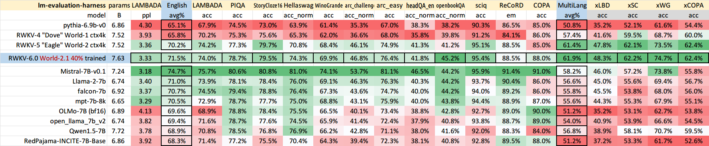

**RWKV Runner GUI** https://github.com/josStorer/RWKV-Runner with one-click install and API

**Raw cutting-edge RWKV weights:** https://huggingface.co/BlinkDL

**HF-compatible RWKV weights:** https://huggingface.co/RWKV

**RWKV pip package**: https://pypi.org/project/rwkv/

```python
os.environ["RWKV_JIT_ON"] = '1'
os.environ["RWKV_CUDA_ON"] = '0' # if '1' then use CUDA kernel for seq mode (much faster)
from rwkv.model import RWKV                         # pip install rwkv
model = RWKV(model='/fsx/BlinkDL/HF-MODEL/rwkv-4-pile-1b5/RWKV-4-Pile-1B5-20220903-8040', strategy='cuda fp16')

out, state = model.forward([187, 510, 1563, 310, 247], None)   # use 20B_tokenizer.json
print(out.detach().cpu().numpy())                   # get logits
out, state = model.forward([187, 510], None)
out, state = model.forward([1563], state)           # RNN has state (use deepcopy if you want to clone it)
out, state = model.forward([310, 247], state)
print(out.detach().cpu().numpy())                   # same result as above
```

**nanoRWKV**: https://github.com/BlinkDL/nanoRWKV (does not require custom CUDA kernel to train, works for any GPU/CPU)

## RWKV Discord: https://discord.gg/bDSBUMeFpc (7k+ members)

**Twitter**: https://twitter.com/BlinkDL_AI

**Homepage**: https://www.rwkv.com/

**Cool Community RWKV Projects**:

All (200+) RWKV projects: https://github.com/search?o=desc&q=rwkv&s=updated&type=Repositories

https://github.com/cgisky1980/ai00_rwkv_server Fastest GPU inference API with vulkan (good for nvidia/amd/intel), supports rwkv5

https://github.com/cryscan/web-rwkv backend for ai00_rwkv_server, supports rwkv5

https://github.com/saharNooby/rwkv.cpp Fast CPU/cuBLAS/CLBlast inference: int4/int8/fp16/fp32, supports rwkv5

https://github.com/daquexian/faster-rwkv supports rwkv5

https://github.com/mlc-ai/mlc-llm/pull/1275 supports rwkv5

https://github.com/RWKV/RWKV-infctx-trainer Infctx trainer

https://github.com/Blealtan/RWKV-LM-LoRA LoRA finetuning

https://github.com/TheRamU/Fay/blob/main/README_EN.md Digital Assistant with RWKV

https://github.com/harrisonvanderbyl/rwkv-cpp-cuda Fast GPU inference with cuda/amd/vulkan

**RWKV v4 in 150 lines** (model, inference, text generation): https://github.com/BlinkDL/ChatRWKV/blob/main/RWKV_in_150_lines.py

**🔥 RWKV v5 in 250 lines 🔥** (with tokenizer too): https://github.com/BlinkDL/ChatRWKV/blob/main/RWKV_v5_demo.py

**RWKV v4 preprint** https://arxiv.org/abs/2305.13048

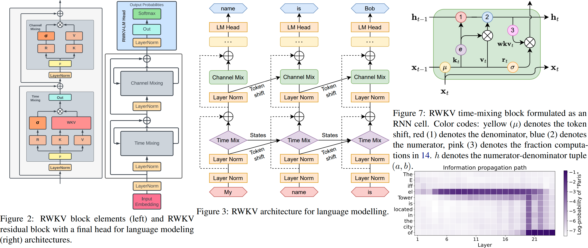

**RWKV v4 introduction, and in 100 lines of numpy**: https://johanwind.github.io/2023/03/23/rwkv_overview.html https://johanwind.github.io/2023/03/23/rwkv_details.html

RWKV v6 illustrated:

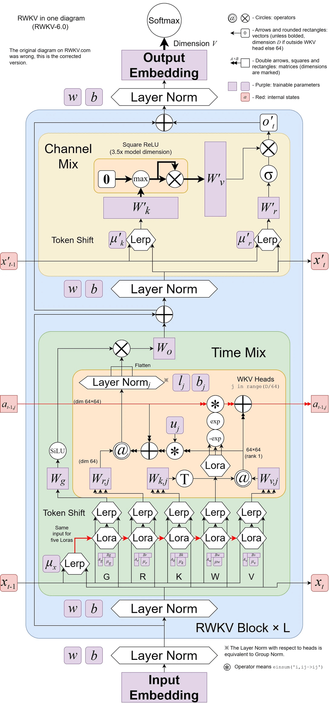

A cool paper (Spiking Neural Network) using RWKV: https://github.com/ridgerchu/SpikeGPT

You are welcome to join the RWKV discord https://discord.gg/bDSBUMeFpc to build upon it. We have plenty of potential compute (A100 40Gs) now (thanks to Stability and EleutherAI), so if you have interesting ideas I can run them.

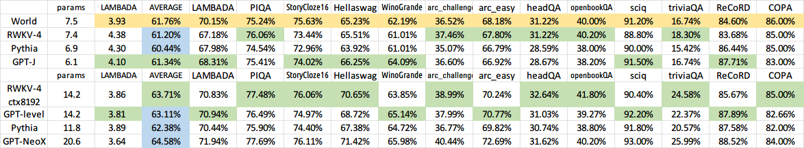

RWKV [loss vs token position] for 10000 ctx4k+ documents in Pile. RWKV 1B5-4k is mostly flat after ctx1500, but 3B-4k and 7B-4k and 14B-4k have some slopes, and they are getting better. This debunks the old view that RNNs cannot model long ctxlens. We can predict that RWKV 100B will be great, and RWKV 1T is probably all you need :)

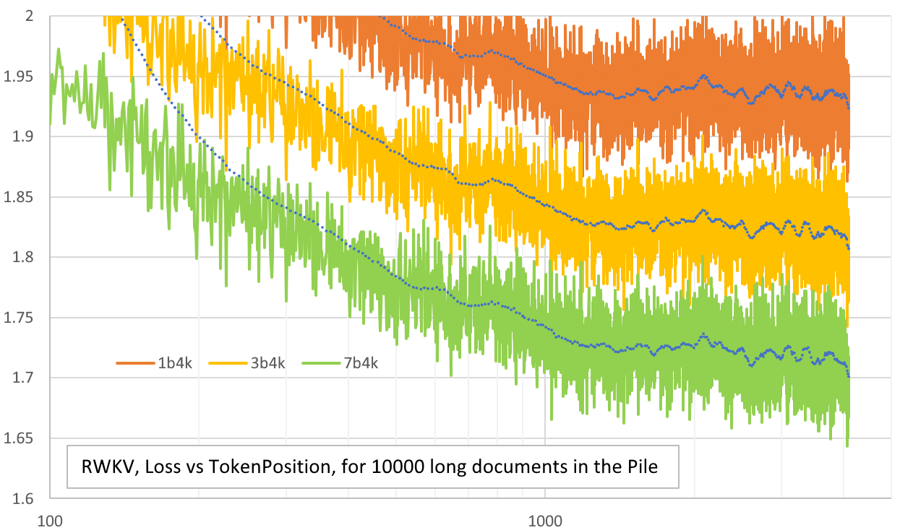

ChatRWKV with RWKV 14B ctx8192:

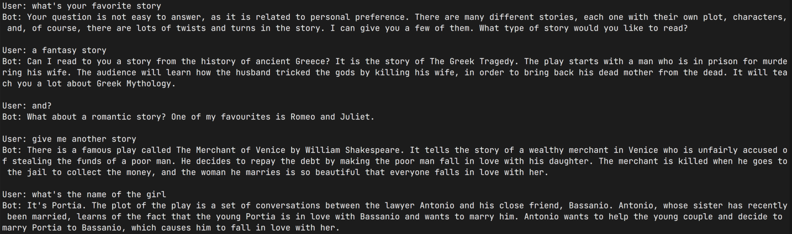

I believe RNN is a better candidate for fundamental models, because: (1) It's more friendly for ASICs (no kv cache). (2) It's more friendly for RL. (3) When we write, our brain is more similar to RNN. (4) The universe is like an RNN too (because of locality). Transformers are non-local models.

RWKV-3 1.5B on A40 (tf32) = always 0.015 sec/token, tested using simple pytorch code (no CUDA), GPU utilization 45%, VRAM 7823M

GPT2-XL 1.3B on A40 (tf32) = 0.032 sec/token (for ctxlen 1000), tested using HF, GPU utilization 45% too (interesting), VRAM 9655M

Training speed: (new training code) RWKV-4 14B BF16 ctxlen4096 = 114K tokens/s on 8x8 A100 80G (ZERO2+CP). (old training code) RWKV-4 1.5B BF16 ctxlen1024 = 106K tokens/s on 8xA100 40G.

I am doing image experiments too (For example: https://huggingface.co/BlinkDL/clip-guided-binary-autoencoder) and RWKV will be able to do txt2img diffusion :) My idea: 256x256 rgb image -> 32x32x13bit latents -> apply RWKV to compute transition probability for each of the 32x32 grid -> pretend the grids are independent and "diffuse" using these probabilities.

Smooth training - no loss spikes! (lr & bsz change around 15G tokens)
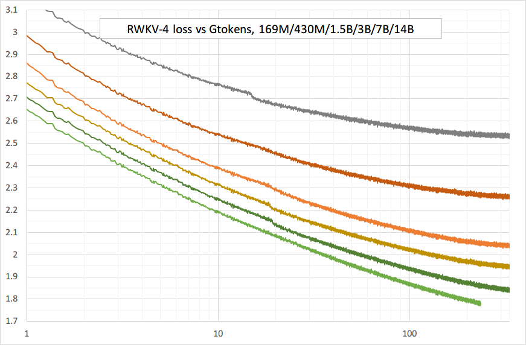

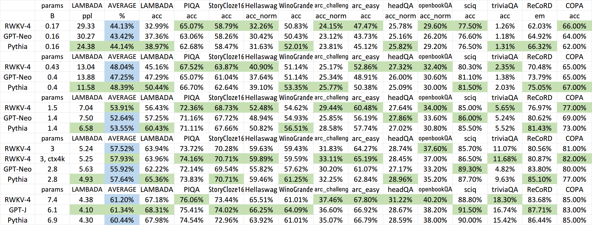

All of the trained models will be open-source. Inference is very fast (only matrix-vector multiplications, no matrix-matrix multiplications) even on CPUs, so you can even run a LLM on your phone.

How it works: RWKV gathers information to a number of channels, which are also decaying with different speeds as you move to the next token. It's very simple once you understand it.

**RWKV is parallelizable because the time-decay of each channel is data-independent (and trainable)**. For example, in usual RNN you can adjust the time-decay of a channel from say 0.8 to 0.5 (these are called "gates"), while in RWKV you simply move the information from a W-0.8-channel to a W-0.5-channel to achieve the same effect. Moreover, you can fine-tune RWKV into a non-parallelizable RNN (then you can use outputs of later layers of the previous token) if you want extra performance.

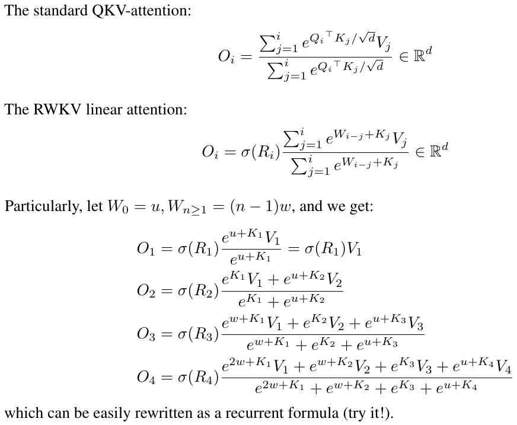

Here are some of my TODOs. Let's work together :)

* HuggingFace integration (check https://github.com/huggingface/transformers/issues/17230
), and optimized CPU & iOS & Android & WASM & WebGL inference. RWKV is a RNN and very friendly for edge devices. Let's make it possible to run a LLM on your phone. 

* Test it on bidirectional & MLM tasks, and image & audio & video tokens. I think RWKV can support Encoder-Decoder via this: for each decoder token, use a learned mixture of [decoder previous hidden state] & [encoder final hidden state]. Hence all decoder tokens will have access to the encoder output.

* Now training RWKV-4a with one single tiny extra attention (just a few extra lines comparing with RWKV-4) to further improve some difficult zeroshot tasks (such as LAMBADA) for smaller models. See https://github.com/BlinkDL/RWKV-LM/commit/a268cd2e40351ee31c30c5f8a5d1266d35b41829

User feedback:
> *I've so far toyed around the character-based model on our relatively small pre-training dataset (around 10GB of text), and the results are extremely good - similar ppl to models taking much, much longer to train.*

> *dear god rwkv is fast. i switched to another tab after starting training it from scratch & when i returned it was emitting plausible english & maori words, i left to go microwave some coffee & when i came back it was producing fully grammatically correct sentences.*

Tweet from Sepp Hochreiter (thank you!): https://twitter.com/HochreiterSepp/status/1524270961314484227

You can find me (BlinkDL) in the EleutherAI Discord too: https://www.eleuther.ai/get-involved/


## Quick start

**IMPORTANT: Use deepspeed==0.7.0 pytorch-lightning==1.9.5 torch==1.13.1+cu117 and cuda 11.7.1 or 11.7 (note torch2 + deepspeed has weird bugs and hurts model performance)**

Use https://github.com/BlinkDL/RWKV-LM/tree/main/RWKV-v4neo (latest code, compatible with v4).

Here is a great prompt for testing Q&A of LLMs. Works for any model: (found by minimizing ChatGPT ppls for RWKV 1.5B)
```python
prompt = f'\nQ & A\n\nQuestion:\n{qq}\n\nDetailed Expert Answer:\n' # let the model generate after this
```

### Inference

**Run RWKV-4 Pile models:** Download models from https://huggingface.co/BlinkDL. Set TOKEN_MODE = 'pile' in run.py and run it. It's fast even on CPU (the default mode).

**Colab for RWKV-4 Pile 1.5B**: https://colab.research.google.com/drive/1F7tZoPZaWJf1fsCmZ5tjw6sYHiFOYVWM

Run RWKV-4 Pile models in your browser (and onnx version): see this issue https://github.com/BlinkDL/RWKV-LM/issues/7

RWKV-4 Web Demo: https://josephrocca.github.io/rwkv-v4-web/demo/ (note: only greedy sampling for now)

For the old RWKV-2: see the release here for a 27M params model on enwik8 with 0.72 BPC(dev). Run run.py in https://github.com/BlinkDL/RWKV-LM/tree/main/RWKV-v2-RNN. You can even run it in your browser: https://github.com/BlinkDL/AI-Writer/tree/main/docs/eng https://blinkdl.github.io/AI-Writer/eng/ (this is using tf.js WASM single-thread mode).

### Training / Fine-tuning

pip install deepspeed==0.7.0 // pip install pytorch-lightning==1.9.5 // torch 1.13.1+cu117

NOTE: add weight decay (0.1 or 0.01) and dropout (0.1 or 0.01) when training on small amt of data. try x=x+dropout(att(x)) x=x+dropout(ffn(x)) x=dropout(x+att(x)) x=dropout(x+ffn(x)) etc.

**Training RWKV-4 from scratch:** run train.py, which by default is using the enwik8 dataset (unzip https://data.deepai.org/enwik8.zip).

You will be training the "GPT" version because it's paralleziable and faster to train. RWKV-4 can extrapolate, so training with ctxLen 1024 can work for ctxLen of 2500+. You can fine-tune the model with longer ctxLen and it can quickly adapt to longer ctxLens.

**Fine-tuning RWKV-4 Pile models:** use 'prepare-data.py' in https://github.com/BlinkDL/RWKV-v2-RNN-Pile/tree/main/RWKV-v3 to tokenize .txt into train.npy data. Then use https://github.com/BlinkDL/RWKV-LM/blob/main/RWKV-v4neo/train.py to train it.

Read the inference code in src/model.py and try using the final hidden state（.xx .aa .bb) as a faithful sentence embedding for other tasks. Probably you should begin with .xx and .aa/.bb (.aa divided by .bb).

Colab for fine-tuning RWKV-4 Pile models: https://colab.research.google.com/github/resloved/RWKV-notebooks/blob/master/RWKV_v4_RNN_Pile_Fine_Tuning.ipynb

**Large corpus:** Use https://github.com/Abel2076/json2binidx_tool to convert .jsonl into .bin and .idx

The jsonl format sample (one line for each document):
```
{"text": "This is the first document."}
{"text": "Hello\nWorld"}
{"text": "1+1=2\n1+2=3\n2+2=4"}
```
generated by code like this:
```
ss = json.dumps({"text": text}, ensure_ascii=False)
out.write(ss + "\n")
```

**Infinite ctxlen training (WIP):** https://github.com/Blealtan/RWKV-LM-LoRA/tree/dev-infctx

### How to use RWKV hidden state as text embedding

Consider RWKV 14B. The state has 200 vectors, that is, 5 vectors for each block: fp16 (xx), fp32 (aa), fp32 (bb), fp32 (pp), fp16 (xx).

Do not avg pool because different vectors (xx aa bb pp xx) in the state have very different meanings and ranges. You can probably remove pp.

I suggest firstly collect the mean+stdev statistics of each channel of each vector, and normalize all of them (note: the normalization should be data-indepedent and collected from various texts). Then train a linear classifer.

## Towards RWKV-5 (just to record some new ideas)

### Lastest Design

RWKV-5 is multi-head and here shows one head. There is also a LayerNorm for each head (hence actually GroupNorm).

$`
\begin{array}{|l|l|l|}
\hline & \text { RWKV-4 with real-valued } k \,\&\, v \,\&\, u \,\&\, w & \text { RWKV-5 with matrix-valued } \mathrm{k}^{\dagger} \mathrm{v} \,\&\, \mathrm{u} \,\&\, \mathrm{w} \\
\hline \mathrm{y}_0 & \mathrm{r}_0 \frac{\mathrm{uk}_0 \mathrm{v}_0}{\mathrm{uk}_0} & \mathrm{r}_0\left(\mathrm{uk}_0^{\dagger} \mathrm{v}_0\right) \\
\hline \mathrm{y}_1 & \mathrm{r}_1 \frac{\mathrm{uk}_1 \mathrm{v}_1+\mathrm{k}_0 \mathrm{v}_0}{\mathrm{uk}_1+\mathrm{k}_0} & \mathrm{r}_1\left(\mathrm{uk}_1^{\dagger} \mathrm{v}_1+\mathrm{k}_0^{\dagger} \mathrm{v}_0\right) \\
\hline \mathrm{y}_2 & \mathrm{r}_2 \frac{\mathrm{uk}_2 \mathrm{v}_2+\mathrm{k}_1 \mathrm{v}_1+\mathrm{wk}_0 \mathrm{v}_0}{\mathrm{uk}_2+\mathrm{k}_1+\mathrm{wk}_0} & \mathrm{r}_2\left(\mathrm{uk}_2^{\dagger} \mathrm{v}_2+\mathrm{k}_1^{\dagger} \mathrm{v}_1+\mathrm{wk}_0^{\dagger} \mathrm{v}_0\right) \\
\hline \mathrm{y}_3 & \mathrm{r}_3 \frac{\mathrm{uk}_3 \mathrm{v}_3+\mathrm{k}_2 \mathrm{v}_2+\mathrm{wk}_1 \mathrm{v}_1+\mathrm{w}^2 \mathrm{k}_0 \mathrm{v}_0}{\mathrm{uk}_3+\mathrm{k}_2+\mathrm{wk}_1+\mathrm{w}^2 \mathrm{k}_0} & \mathrm{r}_3\left(\mathrm{uk}_3^{\dagger} \mathrm{v}_3+\mathrm{k}_2^{\dagger} \mathrm{v}_2+\mathrm{wk}_1^{\dagger} \mathrm{v}_1+\mathrm{w}^2 \mathrm{k}_0^{\dagger} \mathrm{v}_0\right) \\
\hline
\end{array}`$

$`\left[\begin{array}{ll}
\mathrm{y}_{20} & \cdots \mathrm{y}_{2 \mathrm{c}}
\end{array}\right]=\left[\begin{array}{lll}
\mathrm{r}_{20} & \cdots & \mathrm{r}_{2 \mathrm{c}}
\end{array}\right]`$
$`\left(\left[\begin{array}{ccc}
\mathrm{u}_{00} & \cdots & \mathrm{u}_{0 \mathrm{c}} \\
\vdots & \ddots & \vdots \\
\mathrm{u}_{\mathrm{c} 0} & \cdots & \mathrm{u}_{\mathrm{cc}}
\end{array}\right]\left[\begin{array}{ccc}
\mathrm{k}_{20} \mathrm{v}_{20} & \cdots & \mathrm{k}_{20} \mathrm{v}_{2 \mathrm{c}} \\
\vdots & \ddots & \vdots \\
\mathrm{k}_{2 \mathrm{c}} \mathrm{v}_{20} & \cdots & \mathrm{k}_{2 \mathrm{c}} \mathrm{v}_{2 \mathrm{c}}
\end{array}\right]+\left[\begin{array}{ccc}
\mathrm{k}_{10} \mathrm{v}_{10} & \cdots & \mathrm{k}_{10} \mathrm{v}_{1 \mathrm{c}} \\
\vdots & \ddots & \vdots \\
\mathrm{k}_{1 \mathrm{c}} \mathrm{v}_{10} & \cdots & \mathrm{k}_{1 \mathrm{c}} \mathrm{v}_{1 \mathrm{c}}
\end{array}\right]+\left[\begin{array}{ccc}
\mathrm{w}_{00} & \cdots & \mathrm{w}_{0 \mathrm{c}} \\
\vdots & \ddots & \vdots \\
\mathrm{w}_{\mathrm{c} 0} & \cdots & \mathrm{w}_{\mathrm{cc}}
\end{array}\right]\left[\begin{array}{ccc}
\mathrm{k}_{00} \mathrm{v}_{00} & \cdots & \mathrm{k}_{00} \mathrm{v}_{0 c} \\
\vdots & \ddots & \vdots \\
\mathrm{k}_{0 \mathrm{c}} \mathrm{v}_{00} & \cdots & \mathrm{k}_{0 \mathrm{c}} \mathrm{v}_{0 c}
\end{array}\right]
\right)`$

### RWKV-6

Dynamic Mix & Dynamic Decay. Example (do this for both TimeMix & ChannelMix):
```
TIME_MIX_EXTRA_DIM = 32
self.time_mix_k_w1 = nn.Parameter(torch.empty(args.n_embd, TIME_MIX_EXTRA_DIM).uniform_(-0.01, 0.01))
self.time_mix_k_w2 = nn.Parameter(torch.zeros(TIME_MIX_EXTRA_DIM, args.n_embd))
self.time_mix_v_w1 = nn.Parameter(torch.empty(args.n_embd, TIME_MIX_EXTRA_DIM).uniform_(-0.01, 0.01))
self.time_mix_v_w2 = nn.Parameter(torch.zeros(TIME_MIX_EXTRA_DIM, args.n_embd))
self.time_mix_r_w1 = nn.Parameter(torch.empty(args.n_embd, TIME_MIX_EXTRA_DIM).uniform_(-0.01, 0.01))
self.time_mix_r_w2 = nn.Parameter(torch.zeros(TIME_MIX_EXTRA_DIM, args.n_embd))
self.time_mix_g_w1 = nn.Parameter(torch.empty(args.n_embd, TIME_MIX_EXTRA_DIM).uniform_(-0.01, 0.01))
self.time_mix_g_w2 = nn.Parameter(torch.zeros(TIME_MIX_EXTRA_DIM, args.n_embd))
...
time_mix_k = self.time_mix_k.view(1,1,-1) + (x @ self.time_mix_k_w1) @ self.time_mix_k_w2
time_mix_v = self.time_mix_v.view(1,1,-1) + (x @ self.time_mix_v_w1) @ self.time_mix_v_w2
time_mix_r = self.time_mix_r.view(1,1,-1) + (x @ self.time_mix_r_w1) @ self.time_mix_r_w2
time_mix_g = self.time_mix_g.view(1,1,-1) + (x @ self.time_mix_g_w1) @ self.time_mix_g_w2

xx = self.time_shift(x)
xk = x * time_mix_k + xx * (1 - time_mix_k)
xv = x * time_mix_v + xx * (1 - time_mix_v)
xr = x * time_mix_r + xx * (1 - time_mix_r)
xg = x * time_mix_g + xx * (1 - time_mix_g)
```

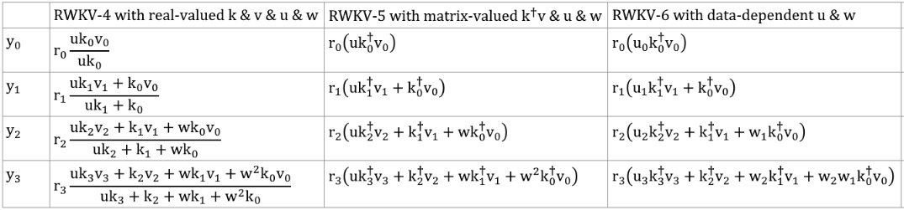

### RWKV-7

Use parallelized mode to quickly generate the state, then use a finetuned full RNN (the layers of token n can use outputs of all layer of token n-1) for sequential generation.

### Some old ideas

1. Now time decay is like 0.999^T (0.999 is learnable). Change it to something like (0.999^T + 0.1) where 0.1 is learnable too. The 0.1 part will be kept forever. Or, A^T + B^T + C = fast-decay + slow-decay + constant. Can even use different formulas (for example, K^2 instead of e^K for a decay component, or, without normalization).

2. Use complex-valued decay (so, rotation instead of decay) in some channels.

3. Inject some trainable and extrapolatable positional encoding?

4. Aside from 2d rotation, we can try other Lie groups such as 3d rotation ( SO(3) ). Non-abelian RWKV lol.

5. RWKV might be great on analog devices (search for Analog Matrix-vector multiplication & Photonic Matrix-vector multiplication). The RNN mode is very hardware-friendly (processing-in-memory). Can be a SNN too (https://github.com/ridgerchu/SpikeGPT). I wonder if it can be optimized for quantum computation.

6. Trainable initial hidden state (xx aa bb pp xx).

7. Layerwise (or even row/column-wise, elementwise) LR, and test Lion optimizer.

### Vision Tasks

1. I find it's good to add a 2d pos encoding:
```
self.pos_emb_x = nn.Parameter(torch.zeros((1,args.my_pos_emb,args.n_embd)))
self.pos_emb_y = nn.Parameter(torch.zeros((args.my_pos_emb,1,args.n_embd)))
...
x = x + pos_emb_x + pos_emb_y
```

2. In a BPE langauge model, it's the best to use [tokenShift of 1 token] (you can mix more tokens in a char-level English model). However you can try [tokenShift of N (or N-1) (or N+1) tokens] if the image size is N x N, because that will be like mixing [the token above the current positon (or the token above the to-be-predicted positon)] with [current token]. You can use try different tokenShift styles for "ATT" & "FFN", or mixing different tokenShift styles - such as mixing [token A] with [token A-1] and [token A-(N-1)] etc.

### Misc

Maybe we can improve memorization by simply repeating the context (I guess 2 times is enough). Example:  Reference -> Reference(again) -> Question -> Answer

#### Idea: Bytes-aware Embedding

The idea is to make sure each token in vocab understand its length and raw UTF-8 bytes.

Let a = max(len(token)) for all token in vocab. Define AA : float[a][d_emb]

Let b = max(len_in_utf8_bytes(token)) for all token in vocab. Define BB : float[b][256][d_emb]

For each token X in vocab, let [x0, x1, ..., xn] be its raw UTF-8 bytes. We will add some extra values to its embedding EMB(X):

EMB(X) += AA[len(X)] + BB[0][x0] + BB[1][x1] + ... + BB[n][xn] (note: AA BB are learnable weights)

* We can do this for the final Linear(d_emb, n_vocab) projection too.
* We can use some small networks to generate AA and BB, for some extra regularization (for example, BB[m][xi] and BB[n][xi] should be related).

#### Old Idea

I have an idea to improve tokenization. We can hardcode some channels to have meanings. Example:

Channel 0 = "space"

Channel 1 = "capitalize first letter"

Channel 2 = "capitalize all letters"

Therefore:

Embedding of "abc":  [0, 0, 0, x0, x1, x2 , ..]

Embedding of " abc":  [1, 0, 0, x0, x1, x2, ..]

Embedding of " Abc":  [1, 1, 0, x0, x1, x2, ..]

Embedding of "ABC": [0, 0, 1, x0, x1, x2, ...]

......

so they will share most of the embedding. And we can rapidly compute the output probability of all variations of "abc".

Note: the above method is assuming that p(" xyz") / p("xyz") is the same for any "xyz", which can be wrong.

Better: define emb_space emb_capitalize_first emb_capitalize_all to be a function of emb.

Maybe the Best: let 'abc' ' abc' etc. to share the last 90% of their embeddings.

At this moment, all our tokenizers spend too many items to represent all variations of 'abc' ' abc' ' Abc' etc. Moreover the model cannot discover that these are actually similar if some of these variations are rare in the dataset. The method here can improve this. I plan to test this in a new version of RWKV.

#### Idea: Better Initial States

Example (single-round Q & A):

1. Generate the final state of all wiki documents.

2. For any user Q, find the best wiki document, and use its final state as the initial state.

3. Train a model to directly generate the optimal initial state for any user Q.

However this can be a bit more tricky for multi-round Q & A :)

## How it works

RWKV is inspired by Apple's AFT (https://arxiv.org/abs/2105.14103).

Moreover it's using a number of my tricks, such as:

* SmallInitEmb: https://github.com/BlinkDL/SmallInitEmb (applicable to all transformers) which helps the embedding quality, and stabilizes Post-LN (which is what I am using).

* Token-shift: https://github.com/BlinkDL/RWKV-LM#token-shift-time-shift-mixing (applicable to all transformers), especially helpful for char-level models.

* Head-QK: https://github.com/BlinkDL/RWKV-LM#the-head-qk-trick-learning-to-copy-and-avoid-tokens (applicable to all transformers). Note: it's helpful, but I disabled it in the Pile model to keep it 100% RNN.

* Extra R-gate in the FFN (applicable to all transformers). I am also using reluSquared from Primer.

* Better initilization: I init most of the matrices to ZERO (see RWKV_Init in https://github.com/BlinkDL/RWKV-LM/blob/main/RWKV-v2-RNN/src/model.py).

* You can transfer some parameters from a small model to a large model (note: I sort & smooth them too), for faster and better convergence (see https://www.reddit.com/r/MachineLearning/comments/umq908/r_rwkvv2rnn_a_parallelizable_rnn_with/).

* My CUDA kernel: https://github.com/BlinkDL/RWKV-CUDA to speedup training.

## The pseudocode (execution from top to bottom):

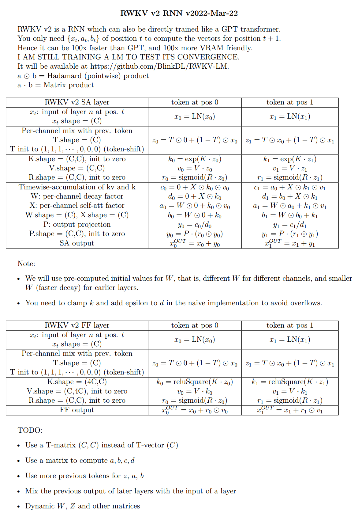

The a b c d factors work together to build a time-decay curve: [X, 1, W, W^2, W^3, ...].

Write out the formulas for "token at pos 2" and "token at pos 3" and you will get the idea:
* a and b: EMAs of kv and k.
* c and d: these are a and b combined with "self-attention".

kv / k is the memory mechanism. The token with high k can be remembered for a long duration, if W is close to 1 in the channel.

The R-gate is important for performance. k = info strength of this token (to be passed to future tokens). r = whether to apply the info to this token.

## RWKV-3 improvements

Use different trainable TimeMix factors for R / K / V in SA and FF layers. Example:
```python
xx = self.time_shift(x)
xk = x * self.time_mix_k + xx * (1 - self.time_mix_k)
xv = x * self.time_mix_v + xx * (1 - self.time_mix_v)
xr = x * self.time_mix_r + xx * (1 - self.time_mix_r)
```

Use preLN instead of postLN (more stable & faster convergence):
```python
if self.layer_id == 0:
	x = self.ln0(x)
x = x + self.att(self.ln1(x))
x = x + self.ffn(self.ln2(x))
```

## Explaining the code for RWKV-3 GPT mode

### The GPT mode - overview

The building blocks of RWKV-3 GPT mode are similar to that of a usual preLN GPT.

The only difference is an extra LN after embedding. Note you can absorb this LN into the embedding after finishing the training.
```python
x = self.emb(idx)  # input: idx = token indices
x = self.ln_emb(x) # extra LN after embedding
x = x + self.att_0(self.ln_att_0(x)) # preLN
x = x + self.ffn_0(self.ln_ffn_0(x))
...
x = x + self.att_n(self.ln_att_n(x))
x = x + self.ffn_n(self.ln_ffn_n(x))
x = self.ln_head(x) # final LN before projection
x = self.head(x)    # output: x = logits
```
It is important to initialize emb to tiny values, such as nn.init.uniform_(a=-1e-4, b=1e-4), to utilize my trick https://github.com/BlinkDL/SmallInitEmb.

For the 1.5B RWKV-3, I use Adam (no wd, no dropout) optimizer on 8 * A100 40G.

batchSz = 32 * 896, ctxLen = 896. I am using tf32 so the batchSz is a bit small. 

For the first 15B tokens, LR is fixed at 3e-4, and beta=(0.9, 0.99).

Then I set beta=(0.9, 0.999), and do an exponential decay of LR, reaching 1e-5 at 332B tokens.

### The GPT mode - ATT block

The RWKV-3 does not have any attention in the usual sense, but we will call this block ATT anyway.
```python
B, T, C = x.size() # x = (Batch,Time,Channel)

# Mix x with the previous timestep to produce xk, xv, xr
xx = self.time_shift(x) # self.time_shift = nn.ZeroPad2d((0,0,1,-1))
xk = x * self.time_mix_k + xx * (1 - self.time_mix_k)
xv = x * self.time_mix_v + xx * (1 - self.time_mix_v)
xr = x * self.time_mix_r + xx * (1 - self.time_mix_r)

# Use xk, xv, xr to produce k, v, r
k = self.key(xk).transpose(-1, -2)
v = self.value(xv).transpose(-1, -2)
r = self.receptance(xr)
k = torch.clamp(k, max=60) # clamp k to avoid overflow
k = torch.exp(k)
kv = k * v

# Compute the W-curve = [e^(-n * e^time_decay), e^(-(n-1) * e^time_decay), ..., 1, e^(time_first)]
self.time_w = torch.cat([torch.exp(self.time_decay) * self.time_curve.to(x.device), self.time_first], dim=-1)
w = torch.exp(self.time_w)

# Use W to mix kv and k respectively. Add K_EPS to wk to avoid divide-by-zero
if RUN_DEVICE == 'cuda':
    wkv = TimeX.apply(w, kv, B,C,T, 0)
    wk = TimeX.apply(w, k, B,C,T, K_EPS)
else:
    w = w[:,-T:].unsqueeze(1)
    wkv = F.conv1d(nn.ZeroPad2d((T-1, 0, 0, 0))(kv), w, groups=C)
    wk = F.conv1d(nn.ZeroPad2d((T-1, 0, 0, 0))(k), w, groups=C) + K_EPS

# The RWKV formula
rwkv = torch.sigmoid(r) * (wkv / wk).transpose(-1, -2)
rwkv = self.output(rwkv) # final output projection
```

The self.key, self.receptance, self.output matrices are all initialized to zero.

The time_mix, time_decay, time_first vectors are transferred from a smaller trained model (note: I sort & smooth them too).

### The GPT mode - FFN block

The FFN block has three tricks comparing with the usual GPT:

1. My time_mix trick.

2. The sqReLU from the Primer paper.

3. An extra receptance-gate (similar to the receptance-gate in ATT block).
```python
# Mix x with the previous timestep to produce xk, xr
xx = self.time_shift(x)
xk = x * self.time_mix_k + xx * (1 - self.time_mix_k)
xr = x * self.time_mix_r + xx * (1 - self.time_mix_r)

# The usual FFN operation
k = self.key(xk)
k = torch.square(torch.relu(k)) # from the Primer paper
kv = self.value(k)

# Apply an extra receptance-gate to kv
rkv = torch.sigmoid(self.receptance(xr)) * kv
return rkv
```
The self.value, self.receptance matrices are all initialized to zero.

## RWKV-4 improvements

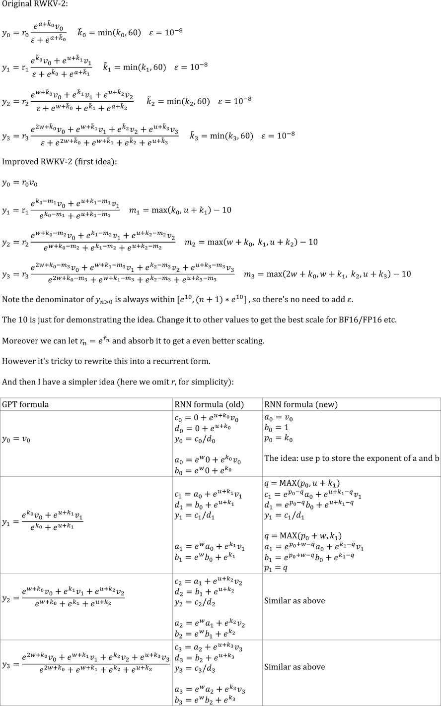

## From GPT to RWKV (the formulas)

Let F[t] be the system state at t.

Let x[t] be the new external input at t.

In GPT, predicting F[t+1] requires considering F[0], F[1], .. F[t]. So it takes O(T^2) to generate a length T sequence.

The **simplified formula** for GPT:

![F[\mathrm{t}+1]=\frac{\sum_{\mathrm{i}=0}^{\mathrm{t}} \exp (\mathbf{Q}x[\mathrm{t}] * \mathbf{K}F[\mathrm{i}]) \cdot(\mathbf{V}F[\mathrm{i}])}{\sum_{\mathrm{i}=0}^{\mathrm{t}} \exp (\mathbf{Q}x[\mathrm{t}] * \mathbf{K}F[\mathrm{i}])}](https://render.githubusercontent.com/render/math?math=%5Ccolor%7Bblack%7D%5Cdisplaystyle+F%5B%5Cmathrm%7Bt%7D%2B1%5D%3D%5Cfrac%7B%5Csum_%7B%5Cmathrm%7Bi%7D%3D0%7D%5E%7B%5Cmathrm%7Bt%7D%7D+%5Cexp+%28%5Cmathbf%7BQ%7Dx%5B%5Cmathrm%7Bt%7D%5D+%2A+%5Cmathbf%7BK%7DF%5B%5Cmathrm%7Bi%7D%5D%29+%5Ccdot%28%5Cmathbf%7BV%7DF%5B%5Cmathrm%7Bi%7D%5D%29%7D%7B%5Csum_%7B%5Cmathrm%7Bi%7D%3D0%7D%5E%7B%5Cmathrm%7Bt%7D%7D+%5Cexp+%28%5Cmathbf%7BQ%7Dx%5B%5Cmathrm%7Bt%7D%5D+%2A+%5Cmathbf%7BK%7DF%5B%5Cmathrm%7Bi%7D%5D%29%7D)

It's very capable in theory, however that **does not mean we can fully utilize its capability with usual optimizers**. I suspect the loss landscape is too difficult for our current methods.

Compare with the **simplified formula** for RWKV (the parallel mode, looks similar to Apple's AFT):

![F[\mathrm{t}+1]=\sigma(\mathbf{R}x[\mathrm{t}]) \cdot \frac{\sum_{\mathrm{i}=0}^{\mathrm{t}} \exp (\mathbf{W} \cdot(\mathrm{t}-\mathrm{i})) \cdot \exp (\mathbf{K}F[\mathrm{i}]) \cdot(\mathbf{V}F[\mathrm{i}])}{\sum_{\mathrm{i}=0}^{\mathrm{t}} \exp (\mathbf{W} \cdot(\mathrm{t}-\mathrm{i})) \cdot \exp (\mathbf{K }F[\mathrm{i}])}](https://render.githubusercontent.com/render/math?math=%5Ccolor%7Bblack%7D%5Cdisplaystyle+F%5B%5Cmathrm%7Bt%7D%2B1%5D%3D%5Csigma%28%5Cmathbf%7BR%7Dx%5B%5Cmathrm%7Bt%7D%5D%29+%5Ccdot+%5Cfrac%7B%5Csum_%7B%5Cmathrm%7Bi%7D%3D0%7D%5E%7B%5Cmathrm%7Bt%7D%7D+%5Cexp+%28%5Cmathbf%7BW%7D+%5Ccdot%28%5Cmathrm%7Bt%7D-%5Cmathrm%7Bi%7D%29%29+%5Ccdot+%5Cexp+%28%5Cmathbf%7BK%7DF%5B%5Cmathrm%7Bi%7D%5D%29+%5Ccdot%28%5Cmathbf%7BV%7DF%5B%5Cmathrm%7Bi%7D%5D%29%7D%7B%5Csum_%7B%5Cmathrm%7Bi%7D%3D0%7D%5E%7B%5Cmathrm%7Bt%7D%7D+%5Cexp+%28%5Cmathbf%7BW%7D+%5Ccdot%28%5Cmathrm%7Bt%7D-%5Cmathrm%7Bi%7D%29%29+%5Ccdot+%5Cexp+%28%5Cmathbf%7BK+%7DF%5B%5Cmathrm%7Bi%7D%5D%29%7D)

The R, K, V are trainable matrices, and W is a trainable vector (time-decay factor for each channel).

In GPT, the contribution of F[i] to F[t+1] is weighted by ![ \exp (\mathbf{Q}x[\mathrm{t}] * \mathbf{K}F[\mathrm{i}]) ](https://render.githubusercontent.com/render/math?math=%5Ccolor%7Bblack%7D%5Cdisplaystyle++%5Cexp+%28%5Cmathbf%7BQ%7Dx%5B%5Cmathrm%7Bt%7D%5D+%2A+%5Cmathbf%7BK%7DF%5B%5Cmathrm%7Bi%7D%5D%29+).

In RWKV-2, the contribution of F[i] to F[t+1] is weighted by ![\sigma(\mathbf{R}x[\mathrm{t}]) \cdot \exp (\mathbf{W} \cdot(\mathrm{t}-\mathrm{i})) \cdot \exp (\mathbf{K}F[\mathrm{i}]) ](https://render.githubusercontent.com/render/math?math=%5Ccolor%7Bblack%7D%5Cdisplaystyle+%5Csigma%28%5Cmathbf%7BR%7Dx%5B%5Cmathrm%7Bt%7D%5D%29+%5Ccdot+%5Cexp+%28%5Cmathbf%7BW%7D+%5Ccdot%28%5Cmathrm%7Bt%7D-%5Cmathrm%7Bi%7D%29%29+%5Ccdot+%5Cexp+%28%5Cmathbf%7BK%7DF%5B%5Cmathrm%7Bi%7D%5D%29+).
* The  is a non-linearity and we can use sigmoid. 
* Note ![\sigma(\mathbf{R}x[\mathrm{t}])](https://render.githubusercontent.com/render/math?math=%5Ccolor%7Bblack%7D%5Cdisplaystyle+%5Csigma%28%5Cmathbf%7BR%7Dx%5B%5Cmathrm%7Bt%7D%5D%29) is not in the denominator, and I call R the "receptance".
* The  is the time-decay factor. I proposed the same idea (scaling the attention by distance) in Aug 2020 and called it the "time-weighting" (check the commit history of https://github.com/BlinkDL/minGPT-tuned).

Here comes the punchline: we can rewrite it into a RNN (recursive formula). Note:

![F[1]=\sigma(\mathbf{R }x[0]) \cdot \frac{ \exp (\mathbf{K }F[0]) \cdot(\mathbf{V }F[0])}{\exp (\mathbf{K }F[0])}](https://render.githubusercontent.com/render/math?math=%5Ccolor%7Bblack%7D%5Cdisplaystyle+F%5B1%5D%3D%5Csigma%28%5Cmathbf%7BR+%7Dx%5B0%5D%29+%5Ccdot+%5Cfrac%7B+%5Cexp+%28%5Cmathbf%7BK+%7DF%5B0%5D%29+%5Ccdot%28%5Cmathbf%7BV+%7DF%5B0%5D%29%7D%7B%5Cexp+%28%5Cmathbf%7BK+%7DF%5B0%5D%29%7D)

![F[2]=\sigma(\mathbf{R }x[1]) \cdot \frac{ \exp (\mathbf{K }F[1]) \cdot(\mathbf{V }F[1])+\exp (\mathbf{W} ) \cdot \exp (\mathbf{K }F[0]) \cdot(\mathbf{V }F[0])}{ \exp (\mathbf{K }F[1])+\exp (\mathbf{W} ) \cdot \exp (\mathbf{K }F[0])}](https://render.githubusercontent.com/render/math?math=%5Ccolor%7Bblack%7D%5Cdisplaystyle+F%5B2%5D%3D%5Csigma%28%5Cmathbf%7BR+%7Dx%5B1%5D%29+%5Ccdot+%5Cfrac%7B+%5Cexp+%28%5Cmathbf%7BK+%7DF%5B1%5D%29+%5Ccdot%28%5Cmathbf%7BV+%7DF%5B1%5D%29%2B%5Cexp+%28%5Cmathbf%7BW%7D+%29+%5Ccdot+%5Cexp+%28%5Cmathbf%7BK+%7DF%5B0%5D%29+%5Ccdot%28%5Cmathbf%7BV+%7DF%5B0%5D%29%7D%7B+%5Cexp+%28%5Cmathbf%7BK+%7DF%5B1%5D%29%2B%5Cexp+%28%5Cmathbf%7BW%7D+%29+%5Ccdot+%5Cexp+%28%5Cmathbf%7BK+%7DF%5B0%5D%29%7D)

Therefore it's straightforward to verify:

![F[t+1]=\sigma(\mathbf{R }x[t]) \cdot \frac{\exp (\mathbf{K}F[\mathrm{t}]) \cdot(\mathbf{V}F[\mathrm{t}])+\exp (\mathbf{W}) \cdot A[\mathrm{t}]}{ \exp (\mathbf{K}F[\mathrm{t}])+\exp (\mathbf{W}) \cdot B[\mathrm{t}]}](https://render.githubusercontent.com/render/math?math=%5Ccolor%7Bblack%7D%5Cdisplaystyle+F%5Bt%2B1%5D%3D%5Csigma%28%5Cmathbf%7BR+%7Dx%5Bt%5D%29+%5Ccdot+%5Cfrac%7B%5Cexp+%28%5Cmathbf%7BK%7DF%5B%5Cmathrm%7Bt%7D%5D%29+%5Ccdot%28%5Cmathbf%7BV%7DF%5B%5Cmathrm%7Bt%7D%5D%29%2B%5Cexp+%28%5Cmathbf%7BW%7D%29+%5Ccdot+A%5B%5Cmathrm%7Bt%7D%5D%7D%7B+%5Cexp+%28%5Cmathbf%7BK%7DF%5B%5Cmathrm%7Bt%7D%5D%29%2B%5Cexp+%28%5Cmathbf%7BW%7D%29+%5Ccdot+B%5B%5Cmathrm%7Bt%7D%5D%7D)

where A[t] and B[t] are the numerator and denominator of the previous step, respectively.

I believe RWKV is performant because W is like repeatedly applying a diagonal matrix. Note (P^{-1} D P)^n = P^{-1} D^n P, so it is similar to repeatedly applying a general diagonalizable matrix.

Moreover it's possible to turn it into a continuous ODE (a bit similar to State Space Models). I will write about it later.

## Star History

[](https://star-history.com/#BlinkDL/RWKV-LM&Date)

## Multimodal ideas

I have an idea for [text --> 32x32 RGB image] using a LM (transformer, RWKV, etc.). Will test it soon.

Firstly, LM loss (instead of L2 loss), so the image will not be blurry.

Secondly, color quantization. For example, only allowing 8 levels for R/G/B. Then the image vocab size is 8x8x8 = 512 (for each pixel), instead of 2^24.
Therefore, a 32x32 RGB image = a len1024 sequence of vocab512 (image tokens), which is a typical input for usual LMs.
(Later we can use diffusion models to upsample and generate RGB888 images. We might be able to use a LM for this too.)

Thirdly, 2D positional embeddings that are easy for the model to understand.
For example, add one-hot X & Y coords to the first 64(=32+32) channels. Say if the pixel is at x=8, y=20, then we will add 1 to channel 8 and channel 52 (=32+20).
Moreover probably we can add the float X & Y coords (normalized to 0~1 range) to another 2 channels. And other periodic pos. encoding might help too (will test). 

Finally, RandRound when doing the color quantization in the DataLoader.
For example, if the float level is 4.578, then there is a 57.8% chance to use 5, and (1-57.8%) chance to use 4.
And we can allow both 4 and 5 in the prediction, but the loss will be higher if the prediction is 4.

Multi-task training might help too. I will try this dataset format:
[TxtFirst] [Desc of Img (txt tokens)] [Img] [img tokens]
and sometimes
[ImgFirst] [img tokens] [Txt] [Desc of Img (txt tokens)]
... the order of the imgs should be randomized in the DataLoader, and [TxtFirst] [ImgFirst] [Img] [Txt] are special tokens
and do random sampling of the full dataset. So sometimes the model will see the img tokens first and then the corresponding txt tokens, which is a [img -> txt] task. And the model will see some partial imgs and partial txts. I think a char-level LM might help the model to write correct text on images.

## How to sample a large dataset (for training)

I am using a trick to sample the Pile deterministically yet randomly enough.

Let's say the pile has x chunks (a chunk = ctx_len tokens).

pick a prime number p just less than x, and make sure p = 2 (mod 3).

Use (step * step * step) mod p to sample it. Add some bias to step for extra randomness.

## The top-p-x sampling method (for inference)

We propose a new sampling method called top-p-x:

it's like top-p, and the only difference is you also keep all tokens whose prob > x.

Try x = 0.01 first.

## Better Learning Rate Schedule via Variantional Method of Loss Curve

I propose a simple new method to find better LR schedules. The method is cost-efficient and practical for large LMs. The takeaway is we can model the loss curve dynamics (phenomenology) w.r.t. the LR, and a nice closed-form LR curve can be directly computed from it using variantional method. Moreover we can predict the final loss with reasonable accuracy.

UPDATE: In "Conclusion 1.", use the best-fitting regime (ignore the initial steps where our approximations break down) to fit the parameters.

Try this: fixed lr for 1 hr, then exponential decay to 0.2 * lr in 12 hrs, and choose the t=[1hr, 13hr] segment.

In the last three plots, black = predicted loss curve of the new LR schedule, blue = original (unoptimized) real loss curve, orange = new LR schedule.


# RWKV v1

We propose the RWKV language model, with alternating time-mix and channel-mix layers:


* The R, K, V are generated by linear transforms of input, and W is parameter. The idea of RWKV is to decompose attention into R(target) * W(src, target) * K(src). So we can call R "receptance", and sigmoid means it's in 0~1 range.

* The Time-mix is similar to AFT (https://arxiv.org/abs/2105.14103). There are two differences.

(1) We changed the normalization (denominator). For masked language models, we define:


**(UPDATE: We are using the original AFT normalization in v2)**
 
Initialize K and R matrices (and the output projection matrix) to ZERO for fast & stable convergence.
 
(2) We decompose W_{t,u,c} and introduce multi-head W (here h is the corresponding head of c):


Moreover we multiply the final output of Time-mix layer by γ(t). The reason for the α β γ factors, is because the context size is smaller when t is small, and this can be compensated using the α β γ factors.

**(UPDATE: We remove α β γ factors in v2-RNN and restrict W to be of a simple form and hence able to rewrite it as RNN)**

* The Channel-mix is similar to GeGLU (https://arxiv.org/abs/2002.05202) with an extra R factor. Initialize R and W matrices to ZERO for fast & stable convergence.

* Finally, we add extra token-shift (time-shift mixing) as in (https://github.com/BlinkDL/minGPT-tuned).

# Token-shift (time-shift mixing)

The token-shift explicitly uses (half the channels of this token) & (half the channels of prev token) to generate all vectors (QKV, RWKV, ...).

```
self.time_shift = nn.ZeroPad2d((0,0,1,-1))

x = torch.cat([self.time_shift(x[:, :, :C//2]), x[:, :, C//2:]], dim = -1)
```

Dividing channels by 2 and shift-1 works great for char-level English and char-level Chinese LM.

However for BPE-level English LM, it's only effective if your embedding is large enough (at least 1024 - so the usual small L12-D768 model is not enough).

My theory on the effectiveness of token-shift:

When we train a GPT, the hidden representation of a token has to accomplish two different objects:

1. Predict the next token. Sometimes this is easy (obvious next token).

2. Collect all previous context info, so later tokens can use it. This is always hard.

The shifted channels can focus on (2), so we have good propagation of info. It's like some kind of residual connection, or a small RNN inside the transformer.

You can use token-shift in usual QKV self-attention too. I looked at the weights, and found V really likes the shifted channels, less so for Q. Makes sense if you think about it. I also found you may want to use less mixing in higher layers.

p.s. There is a MHA_pro model in this repo with strong performance. Give it a try :)

# The Head-QK Trick: learning to copy and avoid tokens

In usual transformer, a small model has difficulty copying tokens (such as person names) in the context. We add extra Q & K to the final output such that the model can directly copy (or avoid) tokens in the context. Afterwards the model will teach itself NER (named entity recognition) if you look at the learned weights.
```
q = self.head_q(x)[:,:T,:] # projecting to 256-d
k = self.head_k(x)[:,:T,:] # projecting to 256-d
c = (q @ k.transpose(-2, -1)) * (1.0 / 256)
c = c.masked_fill(self.copy_mask[:T,:T] == 0, 0)
c = c @ F.one_hot(idx, num_classes = self.config.vocab_size).float()       
x = self.head(x) + c
```
Note: when a token occurs multiple times in the context, it might be better to use max(prob) instead of sum(prob).

# The top-a sampling method

We also propose a new sampling method called top-a (as in src/utils.py):

(1) Find the max probability p_max after softmax.

(2) Remove all entries whose probability is lower than 0.2 * pow(p_max, 2). So it's adaptive, hence "top-a".

(3) Feel free to tune the 0.2 and 2 factor. Tune 0.2 first.

The idea of top-a:
1. If max_prob=0.9, then remove all tokens with prob < 0.162 (so, removing all alternatives)
2. If max_prob=0.5, then remove all tokens with prob < 0.05  (so, allowing more choices)
3. If max_prob=0.1, then remove all tokens with prob < 0.002 (so, allowing lots of possibilities)

```
probs = F.softmax(logits, dim=-1)

limit = torch.pow(torch.max(probs), 2) * 0.02
logits[probs < limit] = -float('Inf')
```

# Performance

Character-level loss on simplebooks-92 dataset https://dldata-public.s3.us-east-2.amazonaws.com/simplebooks.zip

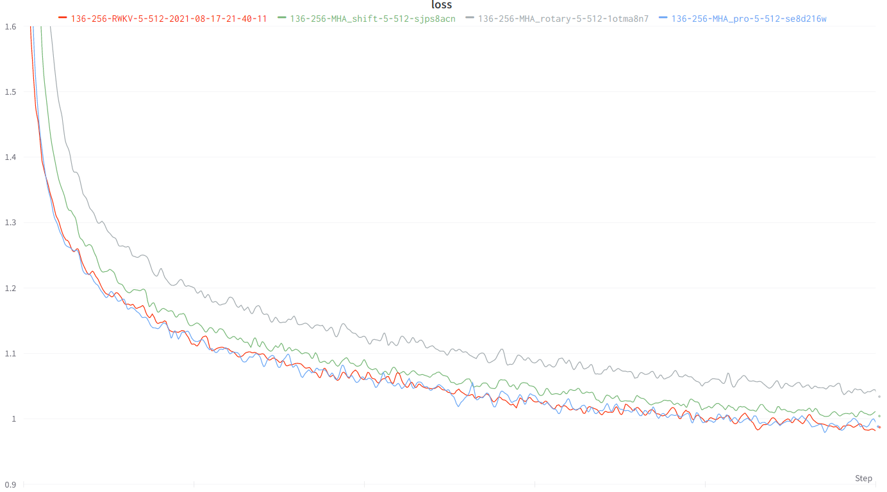

Gray: usual MHA+Rotary+GeGLU - performance not as good. 17.2M params.

Red: RWKV ("linear" attention) - VRAM friendly - quite faster when ctx window is long - good performance. 16.6M params.

Green: MHA+Rotary+GeGLU+Token_shift. 17.2M params.

Blue: MHA_pro (MHA with various tweaks & RWKV-type-FFN) - slow - needs more VRAM - good performance. 16.6M params.

```
@software{peng_bo_2021_5196578,
  author       = {PENG Bo},
  title        = {BlinkDL/RWKV-LM: 0.01},
  month        = aug,
  year         = 2021,
  publisher    = {Zenodo},
  version      = {0.01},
  doi          = {10.5281/zenodo.5196577},
  url          = {https://doi.org/10.5281/zenodo.5196577}
}
```

# Initialization

We use careful initialization for RWKV to get fast convergence - orthogonal matrices with proper scaling, and special time_w curves. Check model.py for details.

Some learned time_w examples:

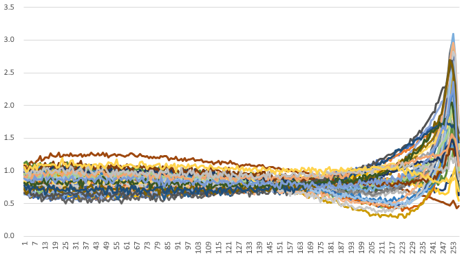
