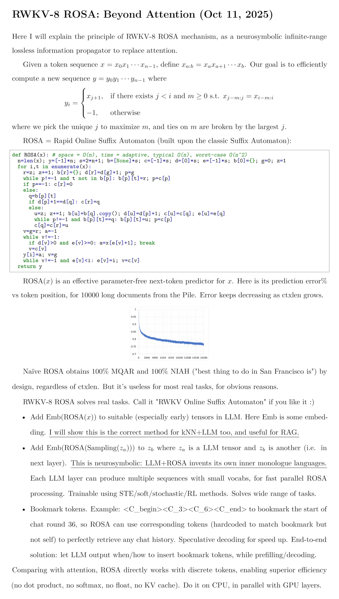
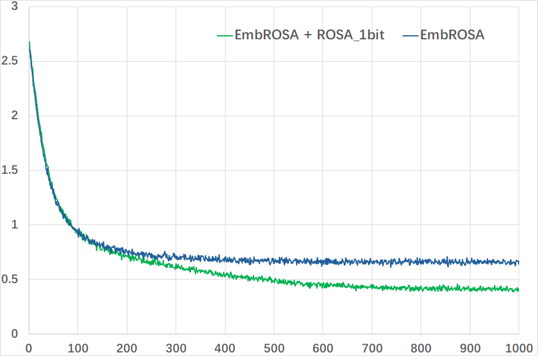

# RWKV-8 "Heron" with ROSA (Rapid Online Suffix Automaton)

p.s. Can use float V in ROSA-QKV (still highly efficient). will try this soon.

### Community ROSA Projects

https://github.com/wjie98/rosa_soft (training ROSA)

https://github.com/zyaaa-ux/ROSA-Tuning (training ROSA)

https://github.com/bcml-ai/rosa-plus

https://github.com/x-0D/RASP

### Introducing ROSA 

251105_reverse_run.py - RWKV7+ROSA with 40K params (L2-D32) reversing 1-60 digits input with 99.8% digit accuracy:

251024_rosaQKV_run.py for arithmetic demo (1M params can solve 40 digits plus/minus with 99% digit accuracy, without CoT):

251016_rosa_1bit_run.py for multi-layer ROSA demo:

251014_rosa_onlyemb_train.py will reach loss ~0.65

251014_rosa_1bit_train.py will reach loss ~0.4

251018_rosa_4bit_train.py will reach loss ~0.25

